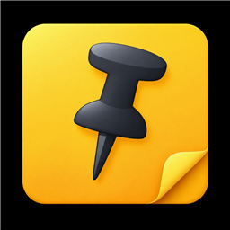
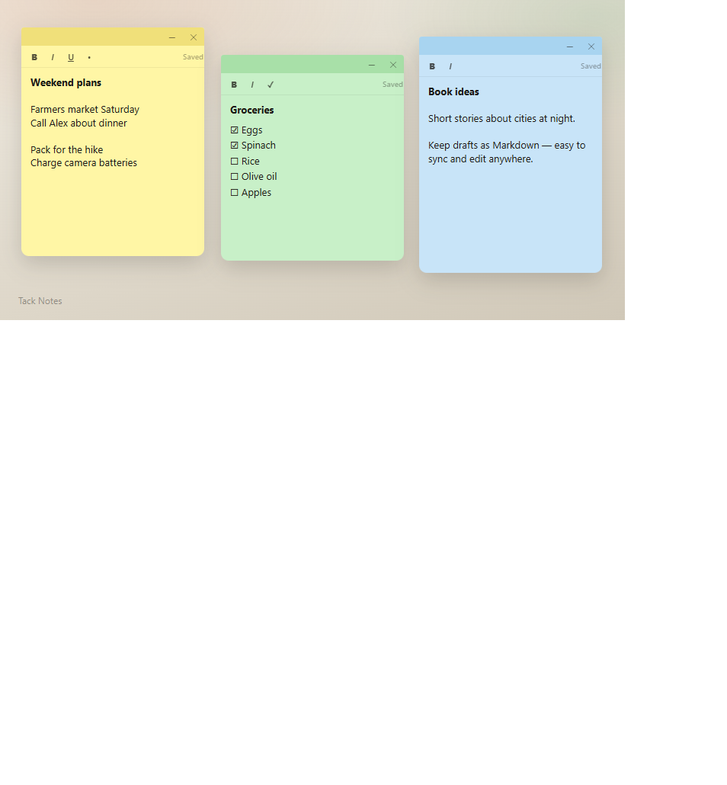
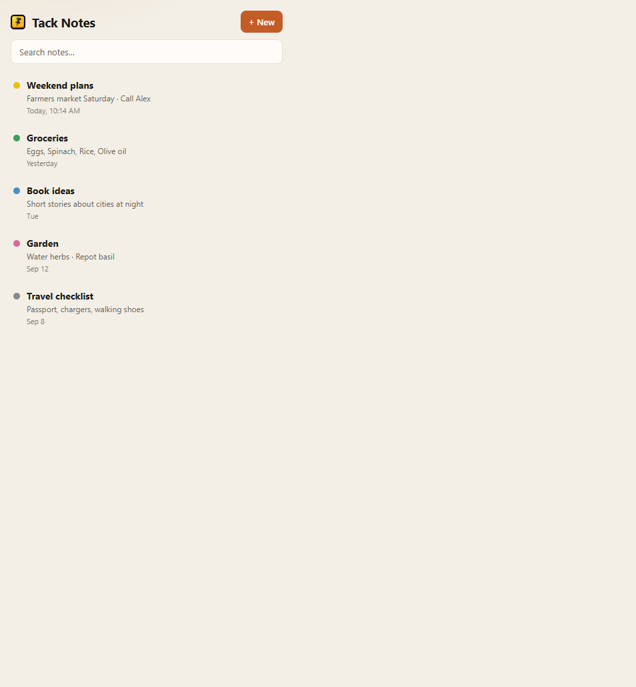
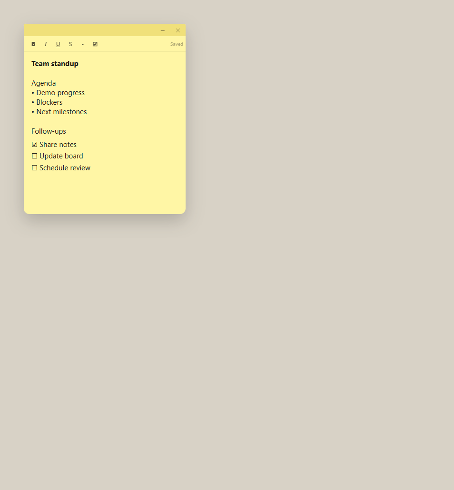
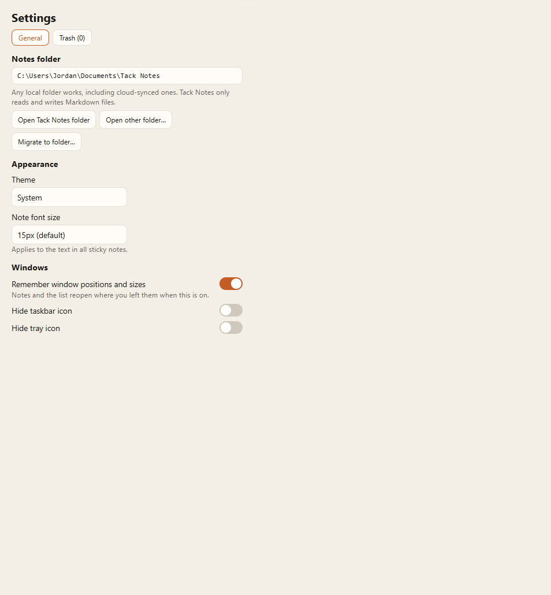

<p align="center">
  
</p>

<h1 align="center">Tack Notes</h1>

<p align="center">
  <strong>Sticky notes that live as Markdown files you control.</strong><br />
  Windows desktop app · offline · sync-folder friendly
</p>

<p align="center">
  <a href="#install">Install</a> ·
  <a href="#features">Features</a> ·
  <a href="#your-notes-your-files">Your files</a> ·
  <a href="#development">Development</a>
</p>

---

<p align="center">
  
</p>

Tack Notes is a Windows sticky-notes app. Each note is a plain UTF-8 Markdown file with a short YAML header — open them in any editor, keep them in Nextcloud, Dropbox, Google Drive, or OneDrive, and edit offline anytime.

It is an original app and is **not** affiliated with Microsoft Sticky Notes.

## Install

1. Download the latest installer from [Releases](https://github.com/AndrejLu/tack-notes/releases/latest) (or build from source below).
2. Run the installer (per-user; admin is not required by default).
3. On first launch, pick a folder for your notes (or accept `Documents\Tack Notes`).

Then create notes from the tray icon, the notes list, or Jump List tasks.

## Screenshots

| Sticky notes | Notes list |
|:---:|:---:|
|  |  |

| A single note | Settings |
|:---:|:---:|
|  |  |

## Features

- **Independent note windows** — move, resize, and pin always-on-top
- **Rich text** — bold, italic, underline, strikethrough, bullets, checklists
- **Colors** — pick a color per note
- **Central list** — search and open any note quickly
- **System tray** — new note, all notes, settings, quit
- **Trash** — recoverable deletes inside your notes folder
- **Autosave** — writes Markdown as you type
- **Themes** — light, dark, or follow Windows
- **Font size** — one setting for all notes
- **Sync-aware** — best-effort merge when files change on disk or another PC, with a clear conflict UI

## Your notes, your files

One note = one file named with a UUID:

```markdown
---
schema_version: 1
id: "550e8400-e29b-41d4-a716-446655440000"
color: "green"
created_at: "2026-09-23T12:00:00Z"
updated_at: "2026-09-23T12:05:00Z"
---
Shopping list

- [ ] Milk
- [x] Bread

**Bold** *italic* <u>underline</u> ~~strike~~
```

- The title in the list is the first nonempty line (or “Untitled note”).
- Trash lives in `.tack-trash/` inside your notes folder.
- App settings and window positions stay under `%APPDATA%\tack-notes\` (outside the synced folder).

### Changing folders

In **Settings**:

- **Open Tack Notes folder** — reveal the current notes folder in Explorer
- **Open other folder…** — switch collections without copying
- **Migrate to folder…** — copy notes into a new folder (won’t overwrite conflicts)

## Sync tips

Cloud folders do not guarantee conflict-free editing. Tack Notes:

1. Detects when the file on disk differs from what you’re editing
2. Merges safe changes automatically when it can
3. Asks you to **Keep mine**, **Keep disk**, or **Keep both** when edits overlap

“Saved” means the file was written on this PC — not that the cloud finished uploading.

## Development

**Requirements:** Windows 10/11 (x64), Node.js 20+, npm

```bash
npm install
npm run dev
```

| Command | Description |
|--------|-------------|
| `npm run dev` | Run with hot reload |
| `npm test` | Unit tests |
| `npm run build` | Compile to `out/` |
| `npm run dist` | Build NSIS installer in `packaged/` |
| `npm run typecheck` | TypeScript check |

Installer output: `packaged/Tack-Notes-Setup-<version>.exe`

## License

MIT — see [LICENSE](LICENSE)

Copyright (c) 2026 Andrej Lukman
